# Employee Management
Simple Spring Boot app to manage Employee with in-memory database

## Requirements

1. Java - 1.8
2. Maven - 3.x.x
3. Spring Boot - 2.2.1.RELEASE 
4. Thymeleaf
5. Spring Data JPA
6. H2-Database
7. PostgreSQL
8. Lombok
9. Hibernate Validation
10. HTML
11. CSS
12. Javascript
13. Bootstrap
14. Git and GitHub
15. Agile Scrum Methodology
16. Docker
17. Jenkins

## Steps to Set up

**1. Go to official Amazon Web Services site**

```bash
https://console.aws.amazon.com/ec2
```

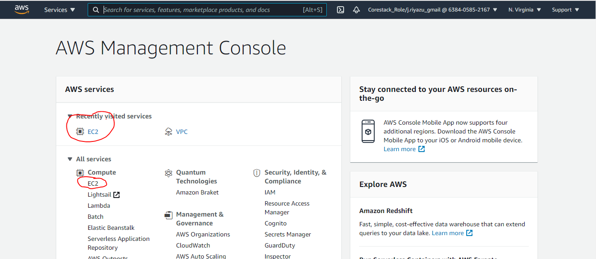

**2. Create New Instance**

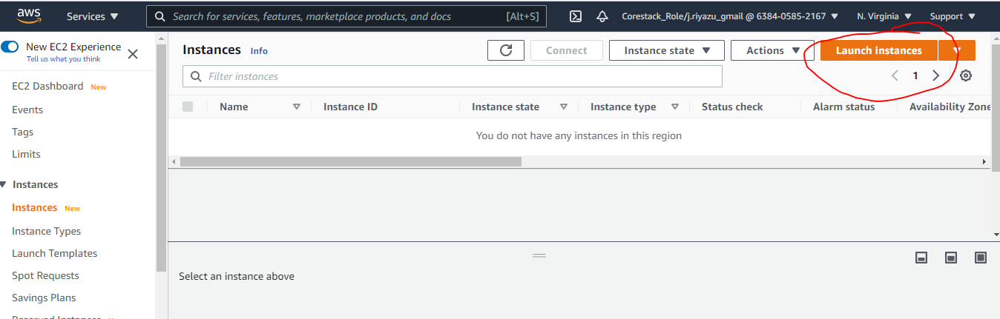

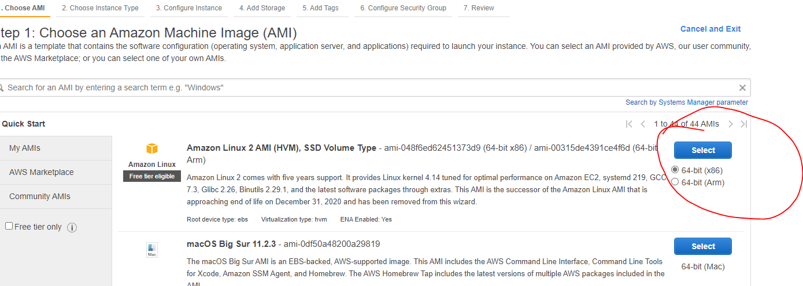

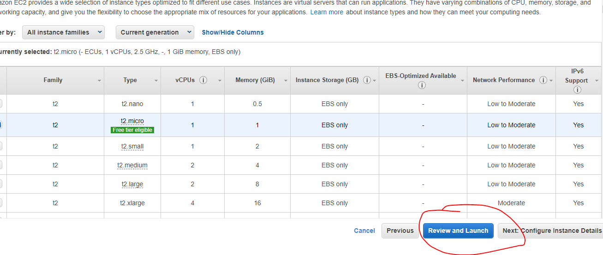

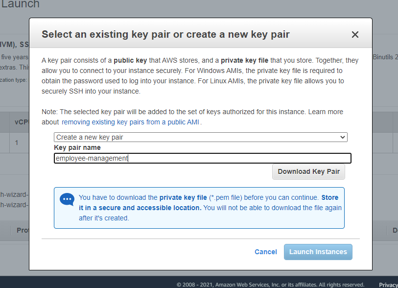

**3. Connect to the Instance**

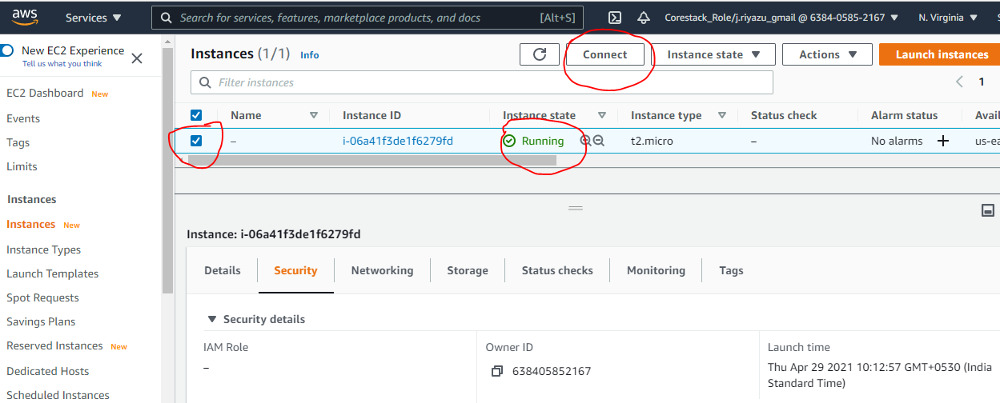

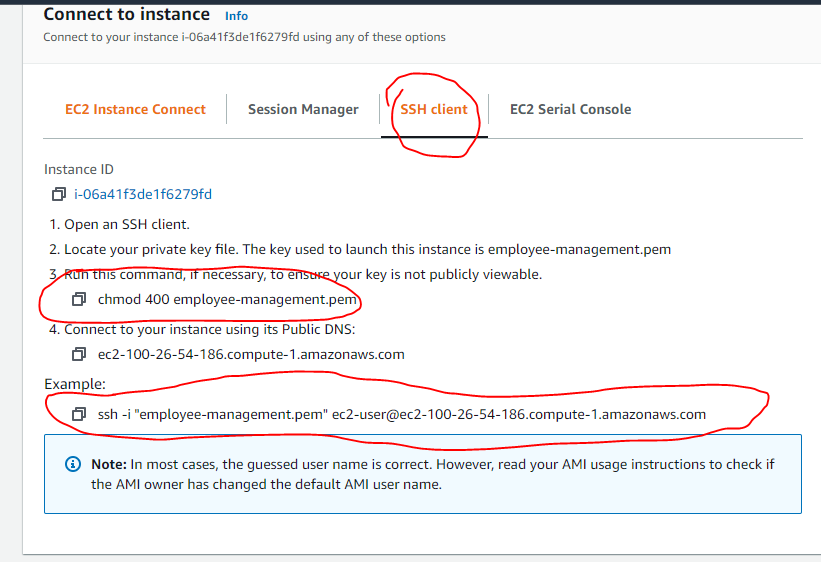

**4. Open Command Prompt in your machine and navigate to the path where you have downloaded the pem file**
```bash
cd Downloads
```

**5. Connect to EC2 Instance by executing the '3rd and example' commands in the ec2 instance**
```bash
chmod 400 employee-management.pem
ssh -i "employee-management.pem" ec2-user@172.31.29.148
```

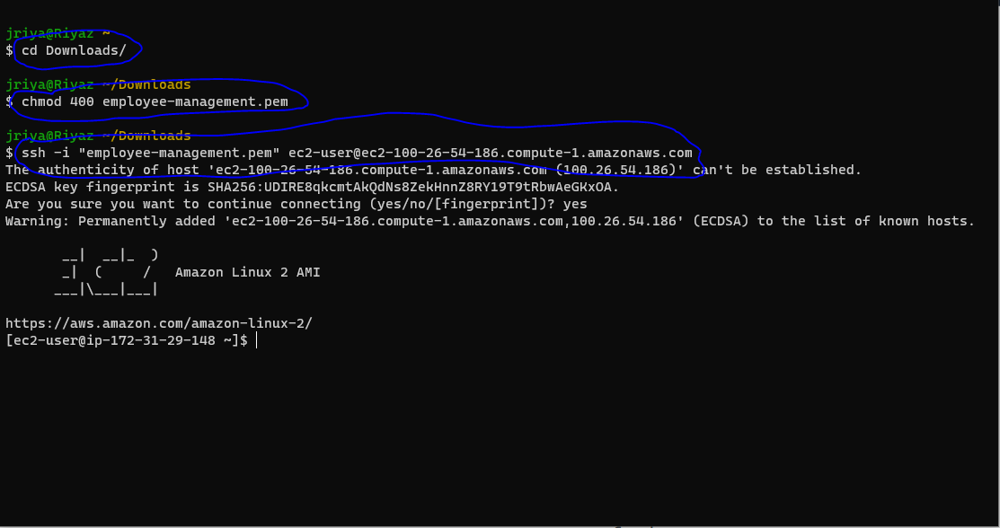

**6. Update the Instance Once connected using the following command**
```bash
sudo yum update -y
```
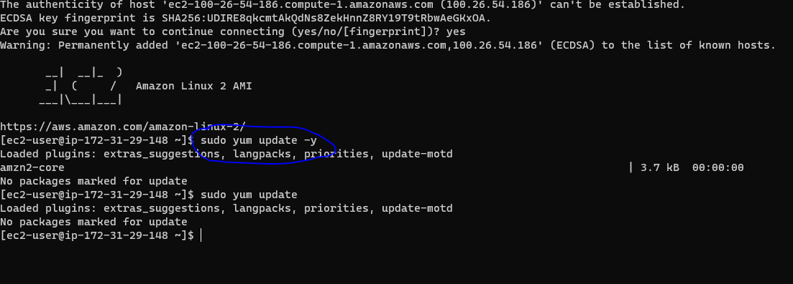

**6. After updating the instance, install Java using the following command**
```bash
sudo yum install java-1.8.0-openjdk
sudo java -version 
```
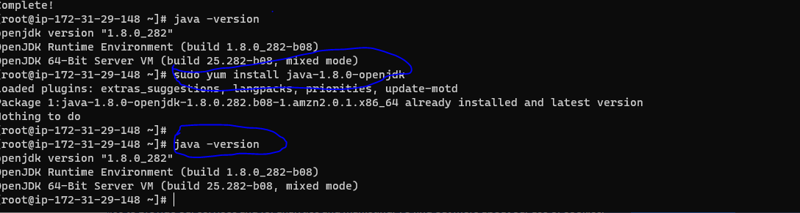

**7. Install Maven and Git**
```bash
sudo yum install maven
sudo mvn -v
sudo yum install git
sudo git --version
```
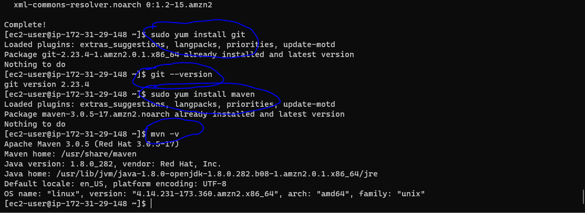

**8. Install Jenkins for more details visit this link: https://pkg.jenkins.io/redhat-stable/**
```bash
sudo wget -O /etc/yum.repos.d/jenkins.repo https://pkg.jenkins.io/redhat-stable/jenkins.repo
sudo rpm --import https://pkg.jenkins.io/redhat-stable/jenkins.io.key
sudo yum install jenkins
```
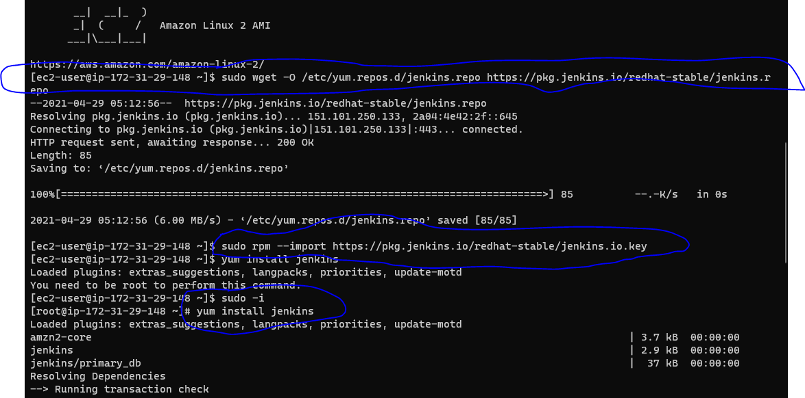

**9. Start Jenkins after installing**
```bash
sudo systemctl start jenkins
```

**10. Check if Jenkins is running on port 8080 along with Public IPv4 addresses like:**
```bash
Example:
The IPv4 addresses of my instance is: 34.207.111.203
The Jenkins is running on 8080 port: 8080
Finally, use both to view jenkins: '34.207.111.203:8080'
```

**11. For the first time Jenkins will ask for password, to find the password, 
execute the following command in the EC2 Instance console**
```bash
sudo cat /var/lib/jenkins/secrets/initialAdminPassword
```
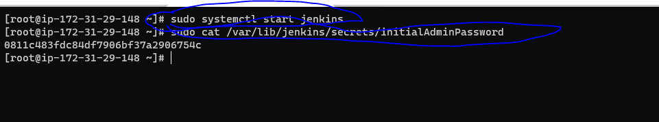

**12. Install the recommended plugins in the jenkins after logging in. After installing plugins, 
jenkins will prompt to create an admin user, go-head and create the user**
```bash
sudo cat /var/lib/jenkins/secrets/initialAdminPassword
```
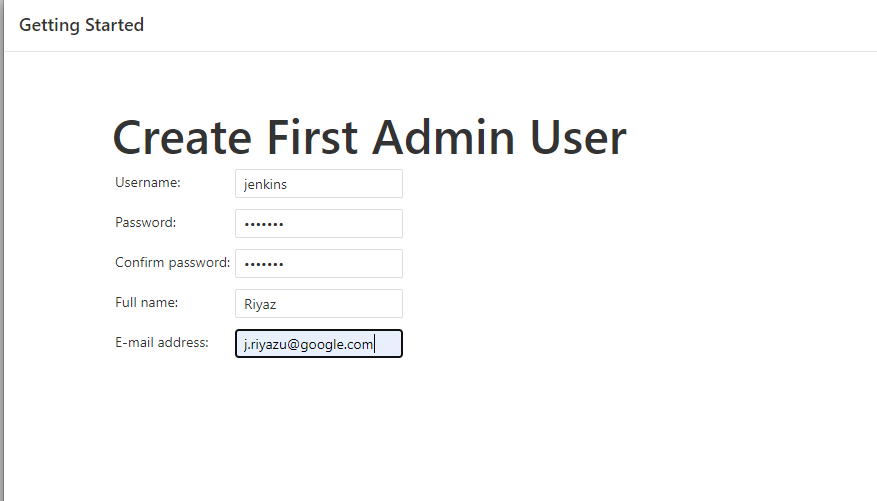


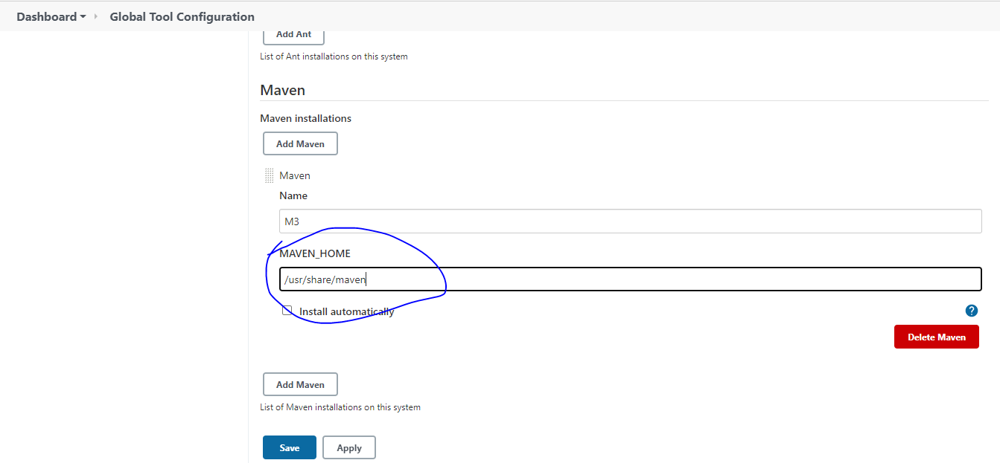

**13. Open EC2 Instance console and Install Docker and start it**
```bash
sudo yum install docker
sudo systemctl start docker
```
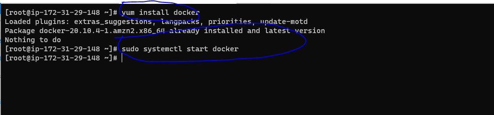

**13.1 Add the Jenkins user to the Docker group using following command in EC2 Instance console. For more details please visit this link: https://stackoverflow.com/questions/47854463/docker-got-permission-denied-while-trying-to-connect-to-the-docker-daemon-socke**
```bash
sudo The user jenkins needs to be added to the group docker
```

**14. Open Jenkins and create a pipeline job**
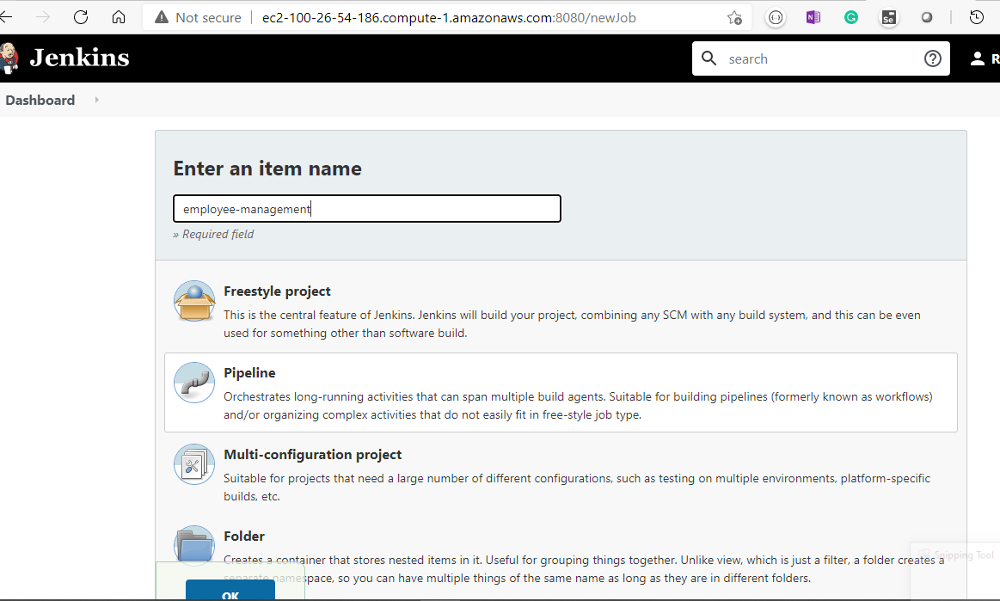


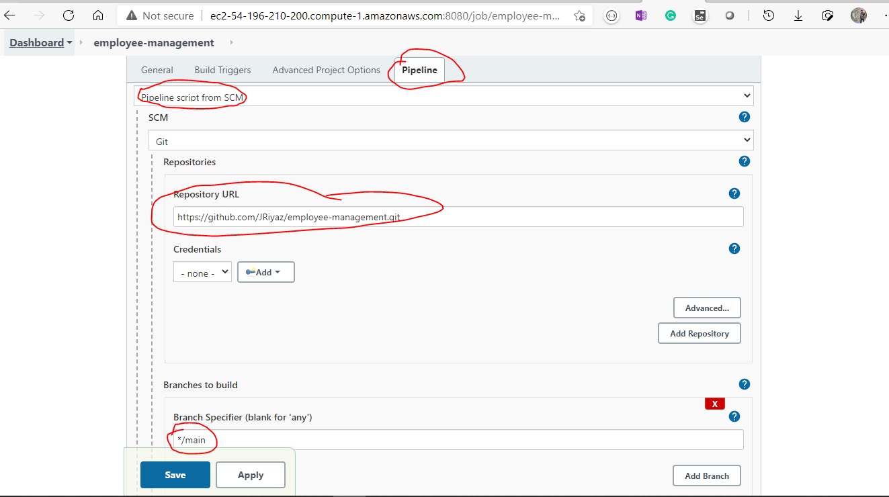

**15. Build the job**

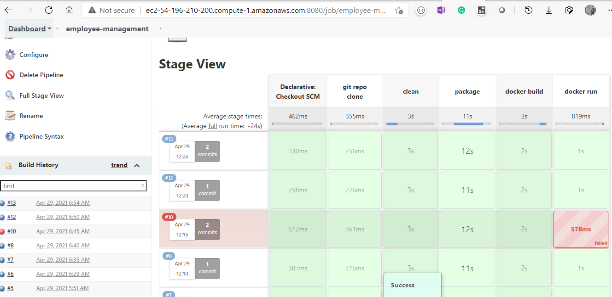


**16. Once the job is built successfully execute the following command to view the Docker images and containers**
```bash
sudo docker images
sudo docker ps
```


**17. Check if the app is running**
```bash
The IPv4 addresses of my instance is: 34.207.111.203
Docker will start the app on port 5555
Finally, use both to use the app: '34.207.111.2038:5555'
```
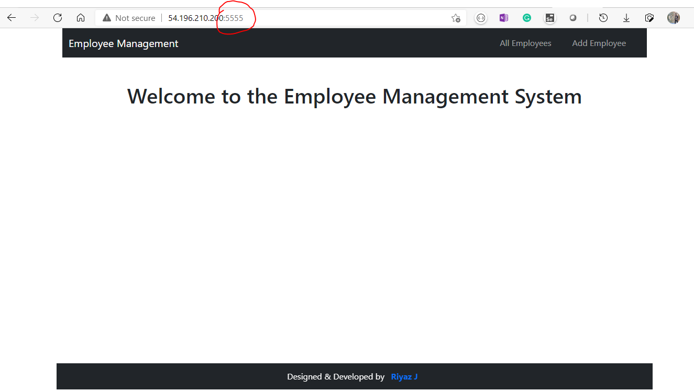

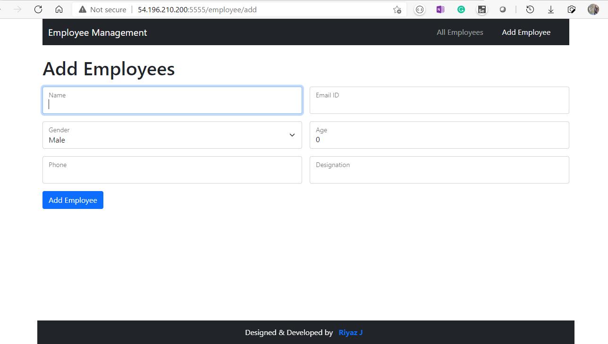

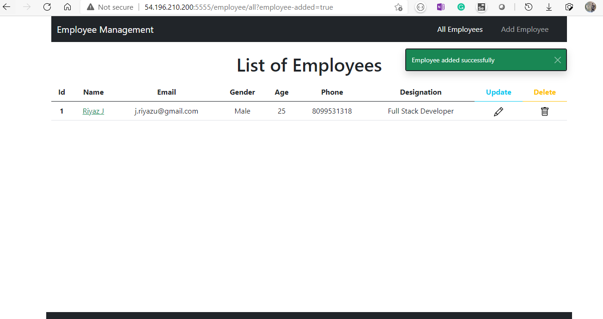

